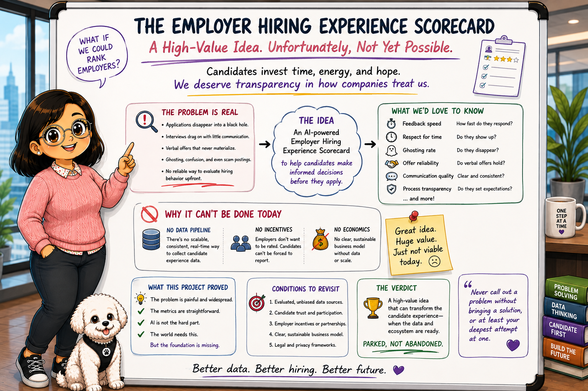

# Employer Hiring Experience Score: Investigation and Feasibility Assessment

  

## TL;DR

I investigated building an AI-powered Employer Hiring Experience Score — a way for candidates to evaluate how companies treat applicants before investing time in applying. This is a discovery/feasibility artifact, not a build-ready PRD. The investigation found that the problem is real, the analytics are straightforward, and AI is not the hard part. The idea breaks on data acquisition and stakeholder incentives: there is no scalable, unbiased, economically sustainable way to collect candidate-experience data today. Verdict: real problem, not yet a viable product — parked, with clear conditions for revisiting.

## 1. Problem Discovery

### Background

The modern job search process is opaque for candidates. Job seekers can find compensation, culture, and employer review information on platforms such as Glassdoor, Blind, and Reddit, but there is no widely accepted way to measure how employers behave during the hiring process.

Candidates often invest significant time applying, completing assessments, and interviewing without knowing whether an employer is responsive, transparent, or respectful of their time.

### Personal Observation

This idea originated from my own experience during a recent job search. I encountered several situations, including:

- Applications that received no response.
- Extended interview processes with little communication.
- Verbal offers that never materialized.
- Potential scam or fraudulent job postings.
- Repeated reports of similar experiences from other candidates.

As I continued my job search and discussed experiences with peers, a common pattern emerged. Many candidates felt their applications disappeared into a "black hole," interviews stretched across multiple rounds without clear feedback, and there was no reliable way to evaluate an employer's hiring practices before applying.

This led to a fundamental question:

> Can job seekers assess an employer's hiring behavior before investing significant time in the application process?

## 2. User Persona

### Primary Persona: Active Job Seeker

#### Background
- Experienced professional seeking new employment opportunities.
- Applies to multiple organizations at once.
- Invests significant time researching companies before applying.
- Values clarity, efficiency, and transparency in the hiring process.

#### Goals
- Find a role that aligns with skills and career goals.
- Avoid fraudulent or low-quality job opportunities.
- Understand whether an employer treats candidates professionally.
- Reduce time wasted on unresponsive hiring processes.

#### Pain Points
- Applications disappear without acknowledgment.
- No visibility into expected hiring timelines.
- Ghosting after one or more interview rounds.
- Lack of reliable information about employer hiring behavior.
- Candidate feedback is scattered across multiple websites.

#### Key Question
> "Is this company worth my time before I apply?"

## 3. Current User Journey

### Current State

| Step | Candidate Action | Pain Point |
|---|---|---|
| 1 | Finds a job posting | Limited information about hiring process quality |
| 2 | Researches the employer | Information is scattered across multiple sources |
| 3 | Applies for the role | No visibility into responsiveness |
| 4 | Waits for a response | High uncertainty and lack of transparency |
| 5 | Participates in interviews | No benchmark for expected timelines |
| 6 | Receives an outcome or gets ghosted | Frustration and wasted effort |

### Future State (Conceptual)

| Step | Candidate Action | Potential Value |
|---|---|---|
| 1 | Finds a job posting | Reviews employer hiring experience data |
| 2 | Evaluates hiring metrics | Understands expected responsiveness |
| 3 | Decides whether to apply | Makes a more informed decision |
| 4 | Participates in the process | Has realistic expectations |
| 5 | Receives an outcome | Can contribute anonymized feedback |

## 4. Opportunity Statement

### The "What If" Question

What if job seekers could access a standardized measure of employer hiring behavior before deciding whether to apply?

### Potential Dimensions
- Responsiveness
- Communication quality
- Hiring process transparency
- Interview efficiency
- Candidate ghosting rates
- Scam risk indicators

The objective would not be to measure company culture or employee satisfaction.

Instead, the focus would be on evaluating the candidate experience during the hiring process.

## 5. Hypothesis

The initial hypothesis was:

> If candidate experience data can be collected consistently and objectively, it may be possible to create an Employer Hiring Experience Score that helps job seekers make more informed decisions.

## 6. Data Requirements

### Required Data Elements

| Data Element | Purpose |
|---|---|
| Company Name | Associate experiences with specific employers |
| Job Title | Normalize comparisons |
| Application Date | Starting point of hiring process |
| First Response Date | Measure employer responsiveness |
| Interview Count | Measure process complexity |
| Days Between Interviews | Measure process efficiency |
| Rejection Date | Measure communication quality |
| Offer Date | Measure successful completion |
| Ghosted Indicator | Identify unresolved candidate journeys |
| Candidate Satisfaction Score | Measure perceived experience |
| Industry | Control variable |
| Company Size | Control variable |

### Potential Derived Metrics

| Metric | Calculation |
|---|---|
| Average Response Time | First Response Date - Application Date |
| Average Hiring Duration | Final Outcome - Application Date |
| Ghosting Rate | Ghosted Applications / Total Applications |
| Communication Rate | Formal Responses / Total Applications |
| Offer Rate | Offers / Applications |
| Hiring Experience Score | Weighted combination of multiple metrics |

## 7. Potential Analytical Approach

Assuming sufficient data existed, several analytical approaches could be used.

### Example: Linear Regression

#### Dependent Variable
Candidate Satisfaction Score

#### Independent Variables
- Average Response Time
- Interview Count
- Ghosting Indicator
- Communication Rate
- Company Size
- Industry

#### Potential Insights
- Impact of response time on candidate satisfaction.
- Relationship between interview complexity and candidate experience.
- Correlation between communication quality and overall satisfaction.
- Factors contributing most strongly to positive hiring experiences.

#### Key Observation
The analytical model itself is relatively straightforward.

The primary challenge is obtaining reliable, unbiased, and scalable data.

## 8. Investigation Findings

The investigation produced several important findings.

### Finding 1
The problem appears to be real and commonly experienced by job seekers. Numerous candidates report concerns related to ghosting, communication delays, and lack of transparency.

### Finding 2
Information relevant to candidate experience exists across multiple platforms, including:
- Glassdoor
- Blind
- Reddit
- LinkedIn
- Personal candidate experiences

### Finding 3
The available information is fragmented, inconsistent, and largely unstructured.

### Finding 4
No single platform has visibility into the complete hiring journey from application submission through final outcome.

### Finding 5
Data quality and reliability represent major concerns because candidate experiences are voluntary, subjective, and potentially biased.

### Finding 6
The largest challenge is not AI, machine learning, or analytics.

The main challenge is creating a scalable mechanism for collecting and validating candidate experience data.

## 9. Risks and Challenges

| Risk | Impact | Likelihood | Mitigation |
|---|---|---|---|
| Insufficient data sources | High | High | Explore alternative collection methods |
| Candidate response bias | High | High | Focus on objective metrics where possible |
| Privacy concerns | High | Medium | Use anonymized data collection |
| Low user participation | High | High | Minimize reporting effort |
| Lack of sustainable business model | High | High | Validate incentives before development |
| Legal concerns around employer ratings | Medium | Medium | Prioritize factual metrics over opinions |

## 10. Assumptions and Validation Status

| Assumption | Status |
|---|---|
| Job seekers care about hiring experience | Partially Validated |
| Hiring experience influences application decisions | Partially Validated |
| Relevant data exists somewhere | Validated |
| Data can be collected at scale | Not Validated |
| Data quality will be sufficient | Not Validated |
| A sustainable business model exists | Not Validated |
| Employers would support such transparency | Not Validated |

## 11. Business Viability Assessment

An important finding from this investigation was the apparent lack of clear economic incentives.

### Primary Beneficiaries
The primary beneficiaries would be job seekers.

### Key Challenges
- Job seekers are unlikely to pay for this information.
- Employers may have little incentive to participate.
- Recruiting platforms typically generate revenue from employers rather than candidates.
- Data collection would depend on sustained community participation.
- Maintaining data quality would require ongoing investment.

As a result, the concept faces a sustainability challenge despite addressing a real problem.

The investigation suggests that the primary barrier is not technical feasibility but the absence of a clear incentive structure for collecting and maintaining candidate experience data at scale.

## 12. Product Management Lessons Learned

This exercise demonstrated several important product management principles.

### Lesson 1
A real problem does not automatically imply a viable product opportunity.

### Lesson 2
Data availability must be validated before evaluating analytical or AI solutions.

### Lesson 3
Stakeholder incentives are often more important than technology.

### Lesson 4
Understanding when not to build a product can be as valuable as building one.

### Lesson 5
AI is not the limiting factor in every problem. In this case, the primary constraint is data acquisition and ecosystem incentives rather than model development.

## 13. When Would I Revisit This?

This idea becomes viable if the data problem is solved by someone who already has the data — for example, an ATS vendor or LinkedIn publishing anonymized process metrics, regulation forcing hiring-process transparency, or employers deciding that a verified “great candidate experience” is worth certifying as a recruiting advantage.
Until then: parked, not abandoned.

## 14. Conclusion

This investigation began with the idea of creating an Employer Hiring Experience Score that would help job seekers evaluate employer hiring behavior before investing significant time in the application process.

The research found that the problem is real, relevant, and frequently experienced by job seekers. However, the study also revealed substantial barriers related to data collection, data quality, privacy, stakeholder incentives, and long-term sustainability. While potential analytical approaches such as regression analysis could be used once sufficient data exists, the primary challenge is not model development.

The investigation concludes that the largest obstacle to building an Employer Hiring Experience Score is the absence of a scalable, unbiased, and economically sustainable method for collecting candidate experience data.

> Successful products require not only a real problem and a technical solution, but also accessible data, aligned stakeholder incentives, and a sustainable business model. Recognizing when those conditions do not exist is an essential skill for both Product Managers and AI Product Managers.
